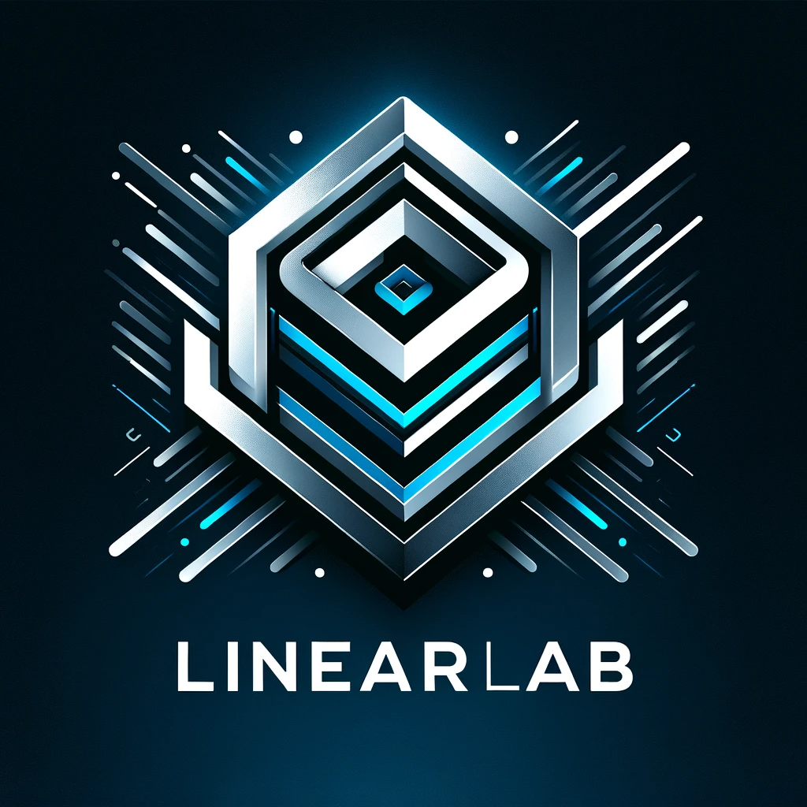

[](https://github.com/mburakbozbey/ml-toolkit/stargazers)
[](https://github.com/mburakbozbey/ml-toolkit/network)
[](https://github.com/mburakbozbey/ml-toolkit/commits/master)
[](https://github.com/mburakbozbey/linear-lab/actions/workflows/python-app.yml)
[](https://github.com/mburakbozbey/linear-lab/actions/workflows/docker-image.yml)

# Simplicity on Steroids: The Overengineered Linear Regressor's Guide 🚀

<div align="center">
  
</div>

**Welcome to a comprehensive toolkit (🏗️🔧 *under construction* 👷‍♂️🧰 ) that elevates linear regression to new heights of sophistication.** This repository offers a meticulously crafted platform, blending a fundamental algorithm with advanced MLOps techniques.

Collaboratively developed with contributions from **Codeium,CodeLlama & ChatGPT-4**, this toolkit stands as a testament to the finesse achievable in the realm of machine learning.

## Repository Structure 📂
Our repository is thoughtfully organized to enhance user experience:
- `data/`: Datasets and preprocessing scripts.
- `models/`: Advanced linear regression models.
- `docker/`: Dockerfiles and related configurations.
- `actions/`: CI/CD workflows and configurations.
- `visualizations/`: Plotly scripts for data visualization.
- `experiments/`: Logs and records of model experiments.
- `utilities/`: Essential utility functions and modules.
- `docs/`: Comprehensive documentation.
- `tests/`: Test suites for code integrity and reliability.

## Getting Started 🚀
### Setting Up the Environment
1. **Clone the Repository**:
   ```bash
   git clone https://github.com/mburakbozbey/linear-lab.git
   cd linear-lab
   ```

2. **Create a Conda Environment**:
   If you haven't already installed Conda, download and install [Anaconda](https://www.anaconda.com/products/individual) or [Miniconda](https://docs.conda.io/en/latest/miniconda.html). Then, create a new Conda environment for this project:
   ```bash
   conda create --name liner_lab_env python=3.8
   ```
   This command creates a new environment named liner_lab_env with Python 3.8, which is recommended for this project. Activate your new environment with:
   ```bash
   conda activate liner_lab_env
   ```

3. **Install Dependencies**:
   Inside the activated Conda environment, install the required dependencies:
   ```bash
   pip install -r requirements.txt
   ```
   This command will install all necessary Python packages as specified in the requirements.txt file.

4. **Run the Linear Regression Model**:
   ```bash
   python main.py 
   ```
   
## License 📄
This project is open-sourced under the MIT License. Feel free to use, modify, and distribute as per the license terms.

## Acknowledgments and References 🙏
- [Improving Language Understanding by Generative Pre-Training (Radford et al. 2018)](https://cdn.openai.com/research-covers/language-unsupervised/language_understanding_paper.pdf)
- [Attention is All You Need (Vaswani et al. 2017)](https://arxiv.org/abs/1706.03762)
- [GPT Guide by Andrej Karpathy](https://m.youtube.com/watch?v=kCc8FmEb1nY)
- [GPT-from-Scratch](https://github.com/LaurenceLungo/GPT-from-Scratch)