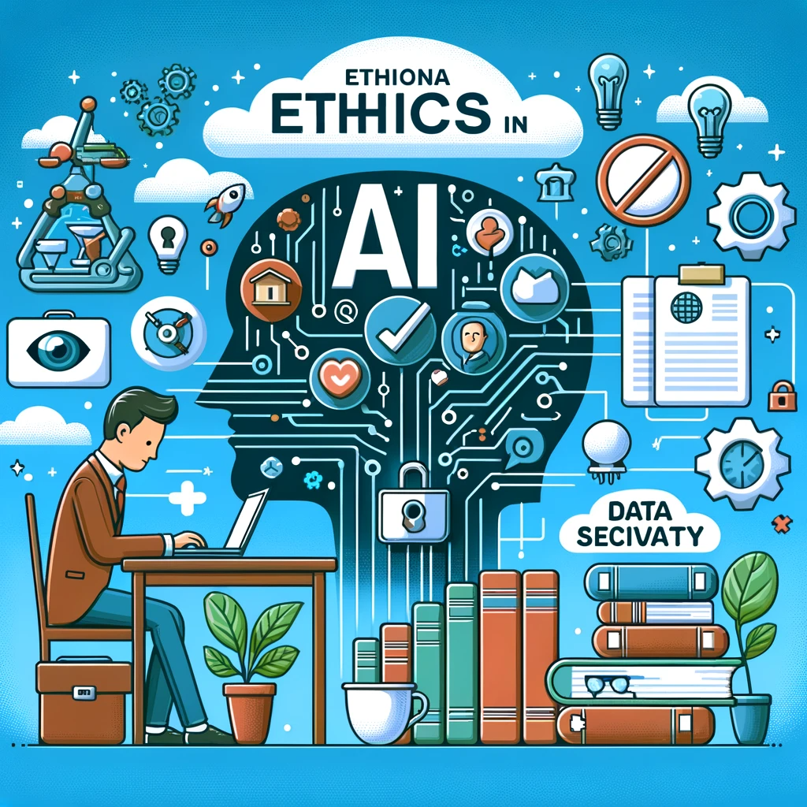

# Mastering the Essentials: Dive into Machine Learning and Numerical Optimization 🚀
**Note: Collaboratively developed with the help of ChatGPT-4.**

## Table of Contents
- [Machine Learning Fundamentals](#machine-learning-fundamentals) 📘
- [Supervised Learning Techniques](#supervised-learning-techniques) 🤖
- [Unsupervised Learning and Data Mining](#unsupervised-learning-and-data-mining) 🔍
- [Deep Learning](#deep-learning) 🧠
- [Specialized Machine Learning Domains](#specialized-machine-learning-domains) 🌐
- [Numerical Optimization Techniques](#numerical-optimization-techniques) 📈
- [Ethics and Privacy in AI](#ethics-and-privacy-in-ai) ⚖️
- [Practical Machine Learning Applications](#practical-machine-learning-applications) 🛠️
- [Project and Process Management in ML](#project-and-process-management-in-ml) 📋
- [Professional Development and Resources](#professional-development-and-resources) 💼
- [Usage](#usage) 📚
- [License](#license) 📄

## Machine Learning Fundamentals 📘

Explore the building blocks of machine learning, covering various learning types and evaluation techniques.

## Supervised Learning Techniques 🤖

Delve into linear models and tree-based methods, understanding their theory and application.

## Unsupervised Learning and Data Mining 🔍

Discover clustering, dimensionality reduction, and other unsupervised learning techniques.

## Deep Learning 🧠

Uncover the intricacies of neural networks and advanced deep learning architectures.

## Specialized Machine Learning Domains 🌐

Gain insights into NLP, time series analysis, and reinforcement learning.

## Numerical Optimization Techniques 📈

Understand various optimization algorithms used in machine learning, including gradient descent and its variants.

## Ethics and Privacy in AI ⚖️

Explore the ethical considerations and privacy concerns in AI, including bias mitigation and data security.

## Practical Machine Learning Applications 🛠️

Learn about model deployment strategies, monitoring techniques, and evaluation methods.

## Project and Process Management in ML 📋

Dive into Agile methodologies, version control, and best practices for ML project management.

## Professional Development and Resources 💼

Access resources for continuous learning and explore various career paths in data science and machine learning.

## Usage 📚
This toolkit is a comprehensive resource for applying machine learning algorithms and optimization techniques, suitable for a wide range of users from students to practitioners.

## License 📄
This project is under the MIT License, allowing free use, modification, and distribution under the license terms.
[View License](https://github.com/mburakbozbey/ml-optimization-toolkit/blob/main/LICENSE)
